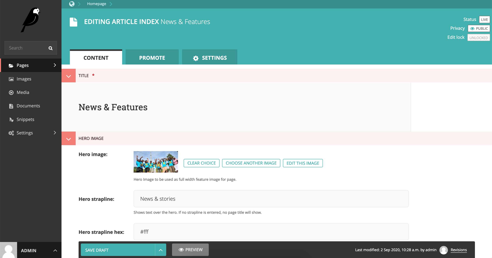
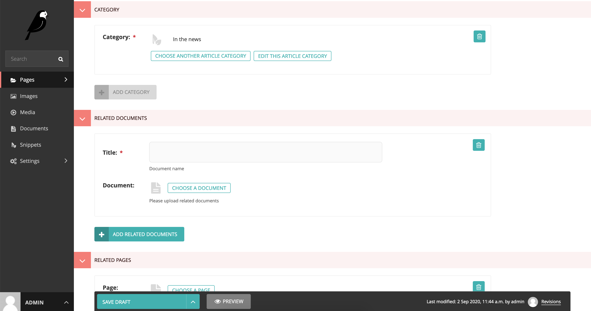

## Wagtail CMS pages

 

The Homepage is the default landing page of the website. It is made up of static content elements coded on the template and dynamic content from the CMS

The CMS supports the following child pages that can be created under `Root > Homepage`

 
Each page type has child page types that can be contained in it as follows:

+ Home page - Child pages can be any of the `2 - 9 options`
+ Article index - Child pages can only be Article page
+ Country page - Child pages can be any of the `3 - 9 options`
+ Job board page - Child pages can be any of the `3 - 9 options`
+ Partner index page - Child pages can be any of the `3 - 9 options`
+ Person index page - Child pages can only be Person page
+ Solution page - Child pages can be any of the `3 - 9 options`
+ Standard index - Child pages can be any of the `2 - 9 options`
+ Standard page - Child pages can be any of the `3 - 9 options`

Every page type has page specific streamfields as well as streamfields common across different pages (Explained further under Streamfields)

 

## Homepage

The Homepage is the main child page of Root and is created by default
You can Edit and populate the main Homepage (The homepage type title can be named differently )

_Navigate and edit the Homepage_

_Edit the Homepage_

_Navigate to create child pages in Homepage_

 

## Article Index page

The article index page can only have Article pages contained by it.

_Create and edit the Article Index page_

_Edit Article Index page specific streamfields_

_Edit Article Index page Body streamfields_

_Add Article Index page categories (Explained further under Snippets)_

 
#### Article page:

_Create and edit the Article page_

_Edit Article page specific streamfields, Body streamfields_

_Add Article page category (Explained further under Snippets)_

Only one category can be assigned to an Article page.

 

## Country page

_Create and edit the Country page_

_Edit Country page specific streamfields, Body streamfields_

_Edit Country page specific streamfields_

 

## Job Board page

_Create and edit the Job Board page_

_Edit Job Board page specific streamfields, Body streamfields_

The job board page shows dynamic content uploaded from the CMS as well
as a JS script embed for job posting populated
from [boards.greenhouse.io](https://boards.greenhouse.io) on the template.

  

### Desktop view

_Static Job Board page on the frontend_

 

## Partner Index page

_Create and edit the Partner Index page_

_Edit Partner Index page specific streamfields_

 

## Person Index page

_Create and edit the Person Index page_

_Edit Person Index page specific streamfields_

## Person page:

_Create and edit the Person page_

_Edit Person page specific streamfields_

_Edit Person page specific streamfields, Body streamfields_

 

## Solution page

_Create and edit the Solution page_

_Edit Solution page specific streamfields_

_Edit Solution page specific streamfields, Body streamfields_

 

## Standard Index page

_Create and edit the Standard Index page_

_Create and edit the Standard Index Body streamfields_

**Exclude from navigation** - option will only exclude linking the standard index page link on its child pages breadcrumb navigation.

 

### Standard page

_Create and edit the Standard page_

_Create and edit the Standard page Body streamfields_
