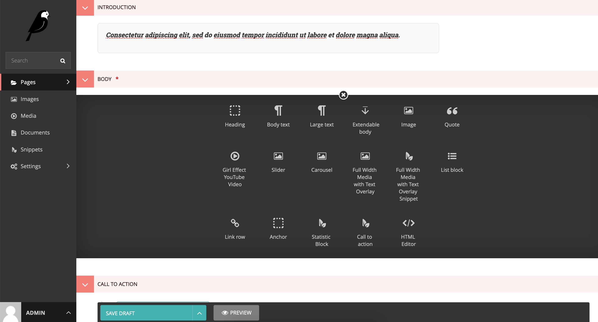

## Navigation components

 

The navigation is a combination of the dynamic CMS content links as well as static social links, logos and search form.

On the frontend the header components elements can be broken down as follows

+ Logo - is a static element on the template, changing this requires editing the template codebase
+ Navigation menu links
+ Social links with icons - are static elements on the template, changing this requires editing the template codebase

Every page type has page specific streamfields as well as streamfields common across different pages (Explained further under Streamfields)

 

## Frontend: Header component

_Desktop view_

_Create and edit the Standard page Body streamfields_

_Mobile view_

 

**CMS: Adding pages**
Add Homepage child pages such as Solution index page

_Create pages in Homepage_

The UX page flow can be structured as follows:

Standard Index page e.g. What we do

* Under the Standard Index page - add a Standard page e.g. Youth Brands
* Under the Standard page - add Solution page e.g. Springster etc.

 

**CMS: Creating Navigation menu links**
Navigate to the following CMS settings on the sidebar  Settings > Navigation settings

_Navigate to CMS Settings: Navigation settings_

_Add Primary Links_

_Add Primary Links - Sub Items_

The main navigation menu links can be added to **PRIMARY LINKS**

* Primary navigation page links are not clickable, on the frontend you can hover over a primary navigation link:
* Under each page you can add clickable Sub Items links and etc.
* All primary links must be local page links and not the external url links

**Secondary Navigation and Footer menu links**

_Desktop view_

_Mobile view_

* The secondary navigation menu links can be added to **SECONDARY LINKS**
* The footer navigation menu links can be added to **FOOTER LINKS**
* Link have three input fields,
    * Page - This is a required field if the External url field is not added.
        * Choose a local page to link to
    * External url - This is a required field if the Page field is not added.
        * Can add a url link
    * Title - This is a required field, when using the External url field
        * You can give a title of the link
