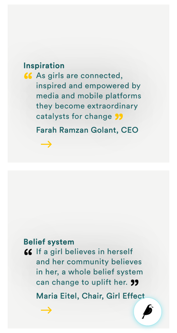

# Stream fields

Stream fields are specialised content edit forms for CMS pages and often common across different page types.

Stream fields can be fixed content ie. simple text only e.g. Page Title, Introduction or Body streamfield etc. where text is interspersed.

This section will outline some of the common stream fields across the different pages.

**Title stream field:**

* Is a fixed short text title of a content module e.g. A page name
* This is a required field

**Hero Video stream field:**

Is a video and an image fallback banner component with caption, page links options and some color customisation.

* The Hero video streamfield support is for the Homepage and Solution page types
* The links can either be  a page link or youtube pop up modal call to action link

**The Hero Video streamfield is made up of the following elements:**

* **Hero video** - the recommended size 12Mb or under, however the CMS Media > Video upload feature does not validate against the following:
    * Media file size upload, I tested and successfully uploaded a 2,42 GB file
    * [Media file format](https://www.encoding.com/html5-video-codec/), I have uploaded an .mp4, Chrome’s .WAP, .mkv etc.
    * NOTE: [Page speed](https://rankdefender.com/website-speed-matters/) and website performance optimization is up to the content owner to compress and upload assets of the recommended sizes.
* **Hero fallback image** - The full width image spec is 2400x1600px, jpeg or png saved for web, and optimized
    * [See guiding specs](https://flothemes.com/flothemes-image-sizes/)
    * Images can be compressed through TinyJPG before being uploaded to the CMS
    * Ideally the image weight should be less than 1Mb
* **Brand logo** - This is a brand logo image field that is only available on the Solution page
* **Hero strapline** - 1 line caption  
* **Hero strapline hex** - add a custom caption text color.
    * [See color picker examples](https://htmlcolorcodes.com/)
* **Page Link** - A banner call to action click through. CHOOSE A PAGE link within the CMS
* YouTube Link - add a YT call to action click through a pop up modal
    * NOTE: You can only use either Page Link or YouTube Link as a time but not both destination
* **Link text** - text button call to action, if not added the banner will not surface a call to action on the frontend.
    * This is a required field

 

## Frontend: Banner component

Banner components consists of

* A video banner component -  an autoplay video banner and an image banner backup
    * A hero video streamfield on the Homepage or a Solution Page
* An image banner component only
    * All other page types or snippets banners are image banners

_Mobile view_
 

_Desktop view_

 

**Introduction stream field:**

CMS:

Introduction streamfield is part of the the Home page and uses a rich text editor

**Body stream field:**

The body content is a required field for every page type, publishing the page without the body content will result in an error.
Body contains 16 to 18 sub-stream fields

CMS:

_Body streamfield_

**Heading stream field** - Simple heading text, this must be no more than 1 line

**Body text stream field** - A rich text editor and Customisation inputs

**Large text stream field** - A rich text editor and Customisation inputs

**Link row stream field** - use one of the links input fields External Link, Internal Link and related text field or Document Link and related link field but no more than 1 at a time

**Anchor stream field** - clean text input editor

_Desktop view_
**Extendable body stream field** -

**Extendable streamfield** is an expand/collapse content animation feature and Customisation inputs with the following fields

* **Body text** - rich text stream field for the initial content
* **Extendable button text**  - call to action when minimum content can be expanded
* **Collapse button text** - call to action when maximum content can be collapsed
* **Extendable body text** - rich text stream field for the rest of the expand content

CMS:

_Body streamfield_

 

**Quotes** stream field

_Mobile view_

Quotes stream field is a quotes content feature and Customisation inputs with the following fields

* **Title** - of the quote
* **Image** - of the quote
* **Text** - a rich text editor and a required input field
* **Citation** - author of the quote
* **Link block** - use one of the links input fields External Link, Internal Link and related text field or Document Link and related link field but no more than 1 at a time
* **Drop shadow** options -
    * **Drop shadow toggle** - applies drop shadows to the quote text
    * **Text hex code color** - changes the quote text color, when this hex color is applied, the Quote mark hex color does not work on the frontend
* **Quote mark hex code** -  changes the quote marks color
