# Snippets

Are grouping of specialized content that can be highlighted for different types of pages or elicit a specific call to action

Snippets such as Categories allow an easy grouping of certain news article pages or a Call to action banner that can be created once and linked to several pages.

CMS:

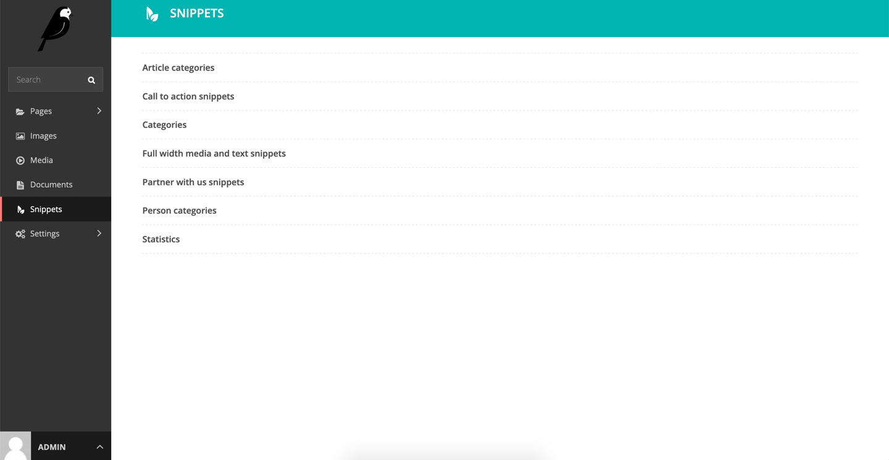
_Snippets settings_

**Article categories:**  Are category grouping for article pages

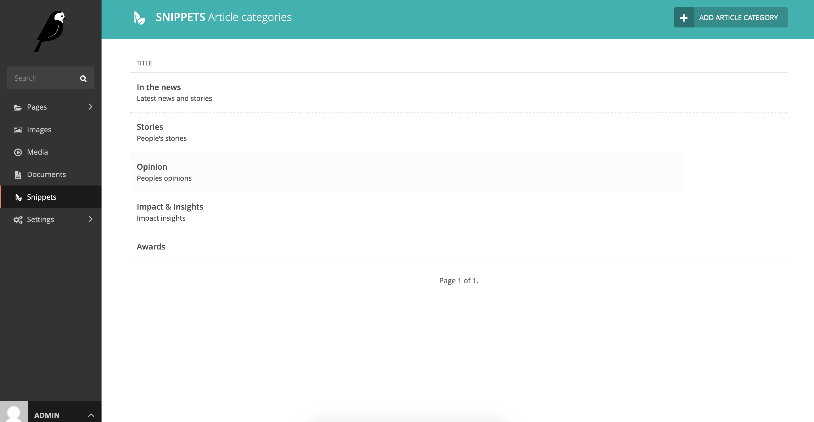
_Article category snippet_

 

Categories are surfaced on the Article index page navigation filter

_Desktop view_
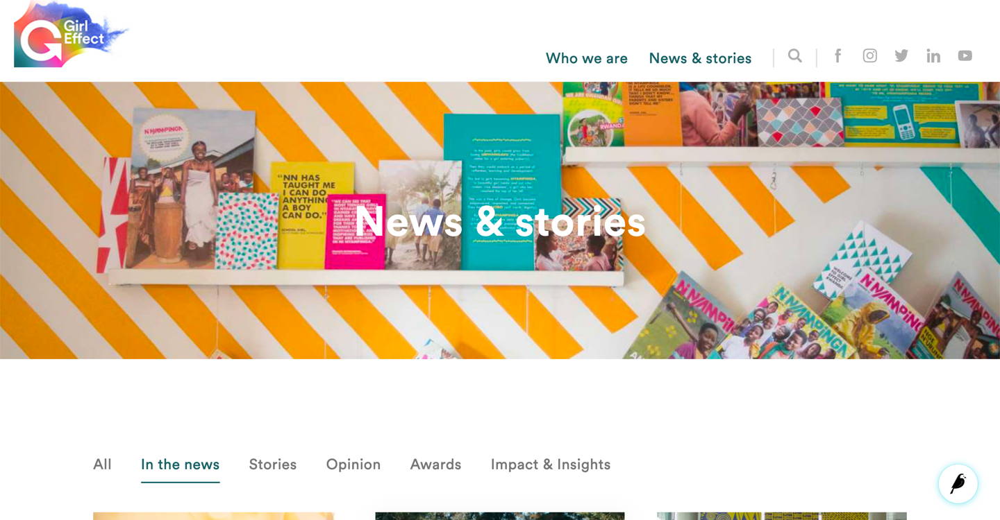

 

**Article categories** can be added to the _Article Index page > Article Index Categories_ section on the

CMS
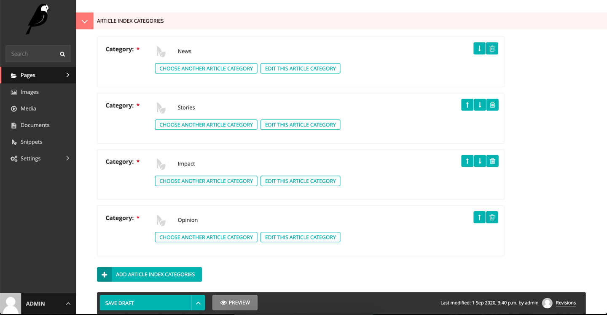

_Article index categories streamfield using snippet_

 

An **Article page** can be assigned one article category at a time
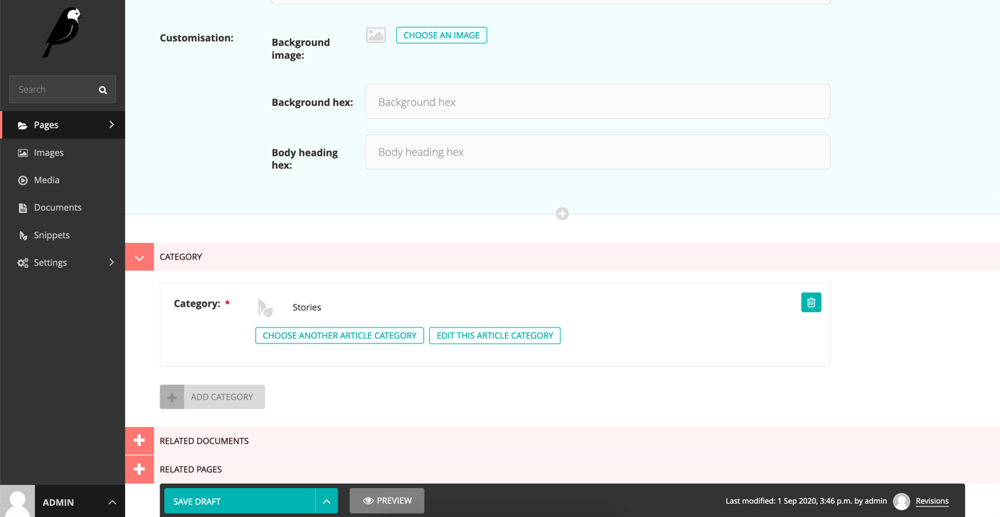

_Article page category snippet_

 

**Call to action snippets:**
A banner message with a strong call to action link to a relevant page

_Desktop view_

CMS
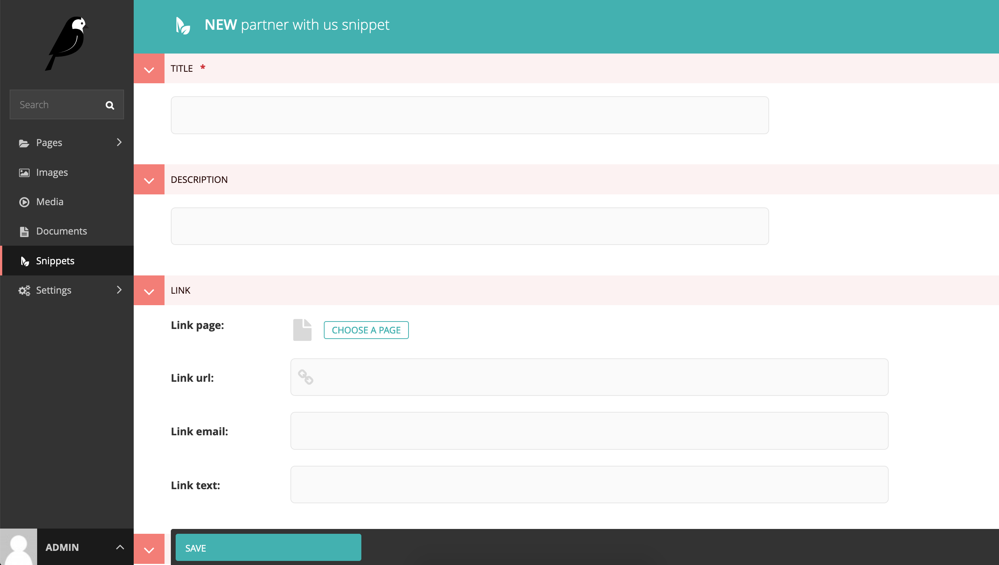
_Call to Action snippet_

The partner with us snippet can be added to the following pages

* Homepage
* Standard page
* Solution page
* Person index page
* Partner index page
* Job board page
* Country page

 

**Categories:** CMS

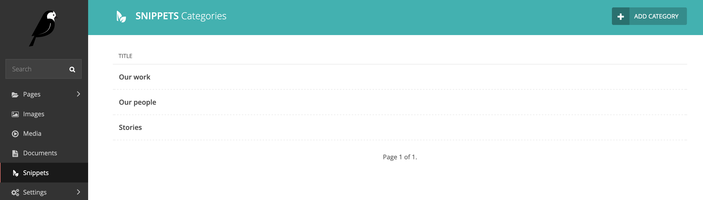

_Category snippet_

 

**Full width media and text snippets:** CMS
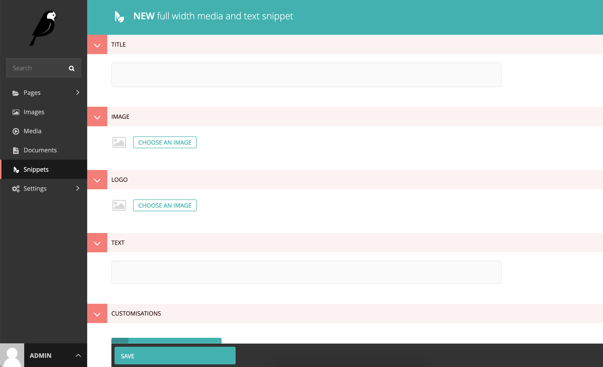
_Full width media and text snippet_

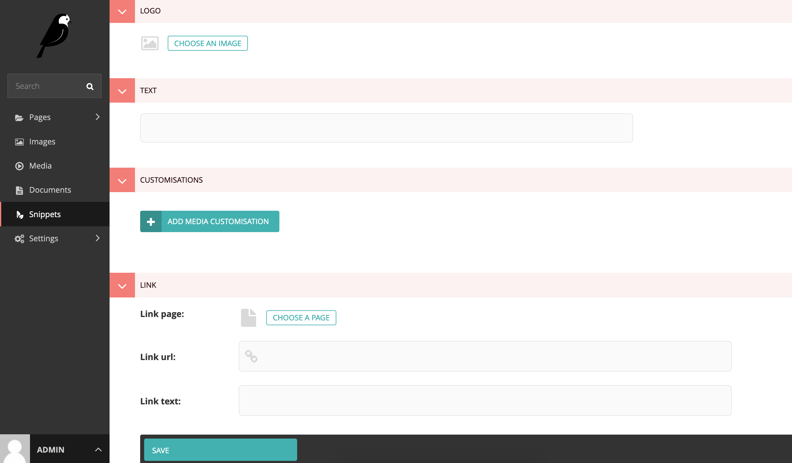
_Full width media and text fields snippet_

 

**Partner with us snippets:**

CMS:
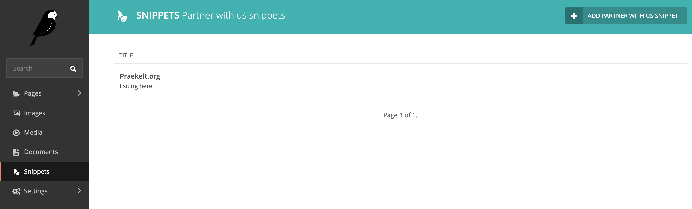

_Partner with us snippet fields_

 

**Persona categories:**

CMS:
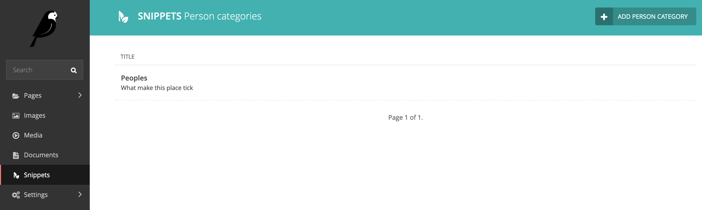
_Person categories snippet_

CMS:
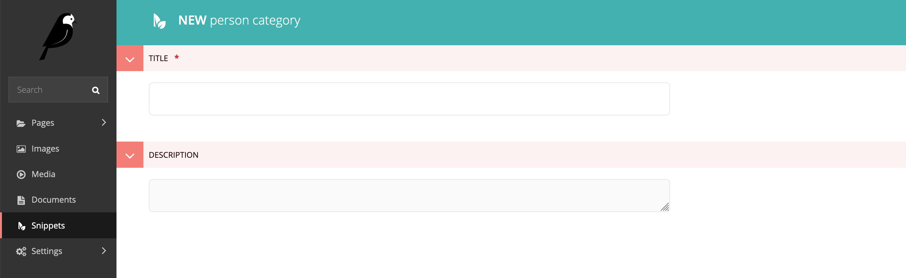
_Person categories snippet field_

 

**Statistics:**

CMS:
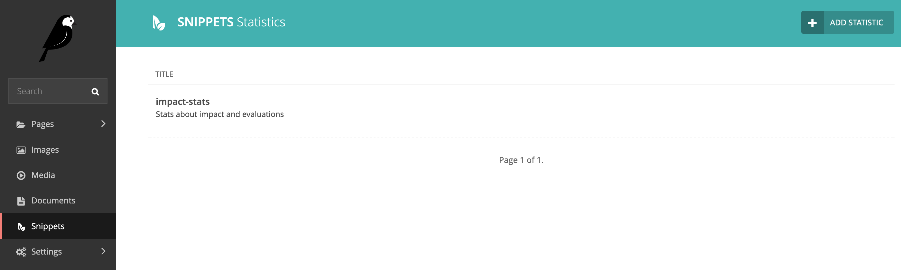
_Statistics snippet_

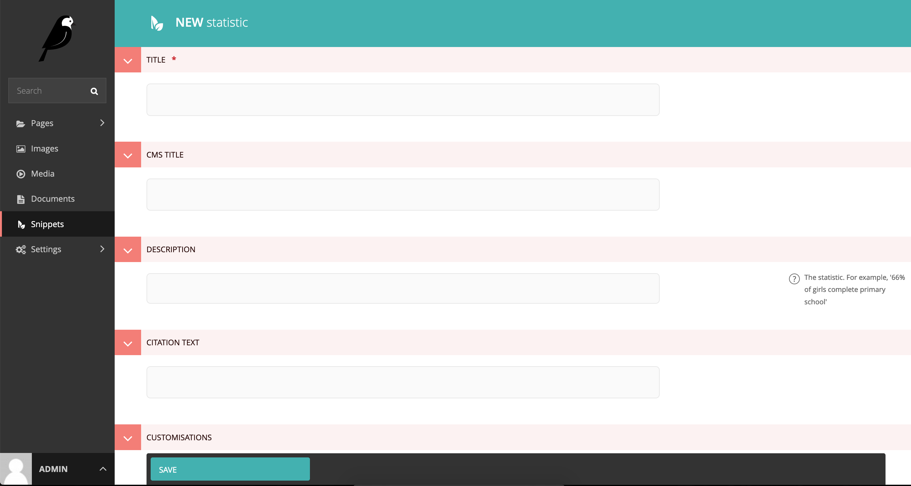
_Statistics snippet field_

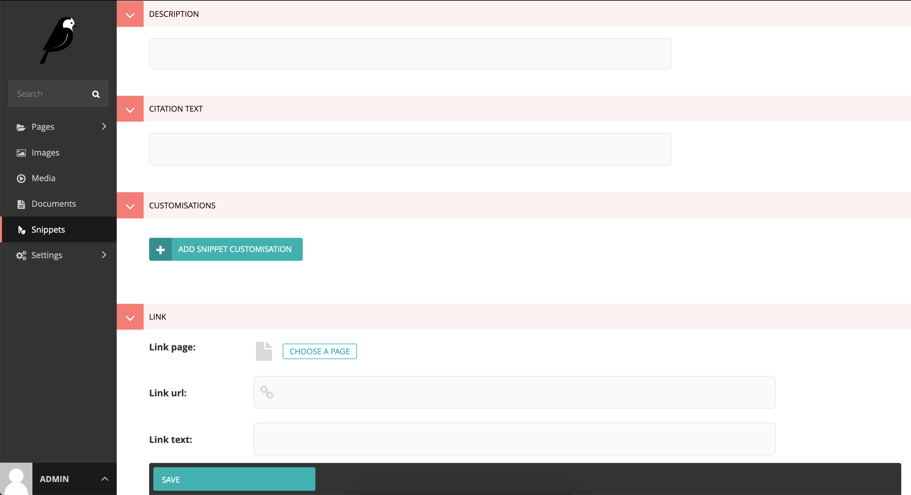
_Statistics snippet field_
